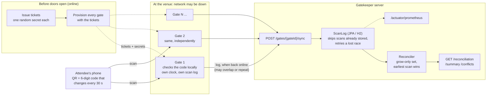

# Gatekeeper

An offline-first venue entry system: gates validate tickets without a network connection,
and duplicate or conflicting scans are caught and reconciled once gates reconnect.

Built in Java 21 (Spring Boot). The problem isn't the "let this ticket in" happy path. It's
staying correct when the network can't be trusted:

1. **Tickets must not be resellable via screenshot.** A ticket's QR code rotates over time
   (TOTP, RFC 6238), so a captured image goes stale.
2. **Gates must work with no connectivity.** A gate validates a scanned code against its own
   copy of the ticket's secret, with no round trip to a server.
3. **Two offline gates can both "accept" the same ticket** before either syncs. The system
   has to detect that after the fact and decide what happened, not just take whichever
   scan arrived at the server first.



## What's here

| Package | What it does |
|---|---|
| `ticket` | Rotating TOTP codes, checked against the RFC 6238 and RFC 4648 published test vectors |
| `gate` | A gate: offline scan validation, duplicate detection at that gate, its own scan log |
| `reconcile` | Merges every gate's log into one picture. A CRDT: upload order doesn't matter, re-sending is harmless |
| `scanlog`, `persistence` | Where synced scans live: in memory (tests) or a database (the app) |
| `api` | The HTTP layer: gates sync in, staff read the reconciled state |
| `observability` | Prometheus metrics, added by wrapping the store so nothing else knows about them |
| `simulation` | An event played end to end (gates offline, skewed clocks, overlapping and repeated uploads) and checked against the gates' own logs |

Design rationale and trade-offs, phase by phase, are in [docs/design.md](docs/design.md). How
the simulation works, what it found and what the measurements do and don't show is in
[docs/simulation.md](docs/simulation.md).

## Run

```powershell
mvn test                       # the whole suite, including the simulation
mvn spring-boot:run            # serves on :8080
curl localhost:8080/healthz
.\scripts\simulate.ps1         # starts a throwaway server, drives it with simulated gates, stops it
```

Java 21 and Maven are required. The app stores scans in a file-based H2 database under
`./data/`, so they survive a restart; delete that directory to start fresh. (`simulate.ps1`
uses its own database and never touches it.)

## API

| | |
|---|---|
| `POST /gates/{gateId}/sync` | A gate delivers its scan log, or a batch or retry of it (up to 10,000 scans per request) |
| `GET /reconciliation` | Every ticket accepted anywhere: who let it in, and who else did |
| `GET /reconciliation/conflicts` | Just the tickets accepted at more than one gate |
| `GET /reconciliation/summary` | Totals only: scans, tickets accepted, conflicts. Prefer this for dashboards; the full report grows with the number of tickets |
| `GET /actuator/prometheus` | Metrics: request latency by route, scans received vs stored, retries after a lost race, reconcile time, current conflicts |
| `GET /healthz` | Liveness |

```bash
curl -X POST localhost:8080/gates/gate-1/sync -H 'Content-Type: application/json' -d '{
  "scans": [{"ticketId": "t-100", "scannedAt": "2026-09-26T18:00:00Z", "accepted": true}]
}'
```

- **Re-syncing is a no-op.** A scan already stored is skipped, so a gate can safely retry after
  a dropped connection, or re-send its whole log. Timestamps are canonicalised to milliseconds
  so a re-sent scan always matches the stored one.
- **`gateId` comes from the URL, never the body**, so one request reports under one identity.
  Nothing authenticates the caller yet, though, so this alone does not stop a client claiming to
  be another gate.
- **Earliest scan wins**, and every other accepted scan for that ticket is kept and reported,
  not discarded. The winner is provisional until every gate has uploaded its whole log: an
  earlier scan can still arrive late and take over.

## Simulation results

`scripts/simulate.ps1` plays an event against a real server over HTTP. Single runs on one
laptop (i5-13420H), with the load generator on the same machine as the server, H2 file
database, 12 gates, batches of up to 1,000 scans:

| Tickets | Scans | Scan records sent (with overlap and retries) | Concurrent gates | Failed requests | Server totals match ground truth |
|---:|---:|---:|---:|---:|:---:|
| 20,000 | 21,856 | 33,796 | 4 | 0 | yes |
| 50,000 | 54,547 | 94,776 | 8 | 0 | yes |
| 100,000 | 109,282 | 142,185 | 8 | 0 | yes |

These runs are also where two real bugs were found, both fixed and covered by regression tests:
a scan with a nanosecond-precision timestamp stopped matching itself when re-sent (the database
rounds it), and two concurrent uploads of overlapping scans made one fail with an HTTP 500
(2 to 5 failures per run before the fix). [docs/simulation.md](docs/simulation.md) has the
detail, including the caveats: these are mocks of real devices, the checks over HTTP compare
totals rather than every ticket, and each `GET /reconciliation*` re-reads every scan, so it
grows linearly with the amount of data.

## Not done

- **Authentication** of gates and of the staff-facing endpoints.
- **Logical or hybrid-logical clocks** for ordering. "Earliest wins" trusts gate clocks to be
  roughly right.
- **A durable local log on the gate itself.** The server persists; a device that loses power
  before syncing would lose its scans.
- **Incremental reconciliation and batched inserts**, both needed well beyond one venue's volume.

The full list, with the reasoning, is at the end of [docs/design.md](docs/design.md).
